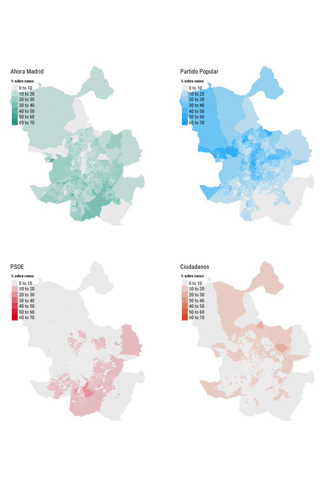

<style>
body {
text-align: justify}
</style>


# Cargar las librerías


```r
# Cargo las librerías
library(sf)
library(tidyverse)
library(mapdeck)
library(knitr)
library(kableExtra)

devtools::install_github("meneos/elecciones") # <--- Instala la librería elecciones

library(elecciones)
```

# Importar el shapefile
Empezamos importanto el shapefile de la Comunidad de Madrid y selecciono solo la ciudad de Madrid.


```r
shp <- read_sf("~/Google Drive/DATOS/R/COMPORTAMIENTO ELECTORAL/shp/Comunidad de Madrid/2015/corregido/secciones_corregidas.shp", quiet = T) ### Importo el shapefile 
shp <- shp[substr(shp$GEOCODIGO, 1, 3) == "079",]  # Selecciono solo la ciudad de Madrid
shp <-  st_transform(shp, 4326)  # Transformo la proyección
```

# Descargar los resultados

Me descargo los resultados a nivel de mesa de las elecciones municipales de mayo de 2015 y me quedo solo con los de la ciudad de Madrid.


```r
results.muni <- mesas("municipales", "2015", "05") # Descargo los datos

results.muni <- results.muni[results.muni$provincia == "28" & results.muni$municipio == "079",] # 28 = Comunidad de Madrid | 079 = Ciudad de Madrid


ktab <- kable(head(results.muni), digits = 4, align = "l", row.names = F)
kable_styling(ktab, bootstrap_options = c("striped", "hover")) %>% scroll_box(width = "100%", height = "200px")
```

<div style="border: 1px solid #ddd; padding: 5px; overflow-y: scroll; height:200px; overflow-x: scroll; width:100%; "><table class="table table-striped table-hover" style="margin-left: auto; margin-right: auto;">
 <thead>
  <tr>
   <th style="text-align:left;"> eleccion </th>
   <th style="text-align:left;"> year </th>
   <th style="text-align:left;"> mes </th>
   <th style="text-align:left;"> partido </th>
   <th style="text-align:left;"> ccaa </th>
   <th style="text-align:left;"> provincia </th>
   <th style="text-align:left;"> municipio </th>
   <th style="text-align:left;"> distrito </th>
   <th style="text-align:left;"> seccion </th>
   <th style="text-align:left;"> mesa </th>
   <th style="text-align:left;"> censo.INE </th>
   <th style="text-align:left;"> CERA </th>
   <th style="text-align:left;"> CERE </th>
   <th style="text-align:left;"> votantes.CERE </th>
   <th style="text-align:left;"> blancos </th>
   <th style="text-align:left;"> nulos </th>
   <th style="text-align:left;"> candidaturas </th>
   <th style="text-align:left;"> votos </th>
   <th style="text-align:left;"> siglas </th>
   <th style="text-align:left;"> denominacion </th>
   <th style="text-align:left;"> code.provincia </th>
   <th style="text-align:left;"> code.autonomia </th>
   <th style="text-align:left;"> code.nacional </th>
  </tr>
 </thead>
<tbody>
  <tr>
   <td style="text-align:left;"> 04 </td>
   <td style="text-align:left;"> 2015 </td>
   <td style="text-align:left;"> 05 </td>
   <td style="text-align:left;"> 120806 </td>
   <td style="text-align:left;"> 12 </td>
   <td style="text-align:left;"> 28 </td>
   <td style="text-align:left;"> 079 </td>
   <td style="text-align:left;"> 13 </td>
   <td style="text-align:left;"> 186 </td>
   <td style="text-align:left;"> A </td>
   <td style="text-align:left;"> 836 </td>
   <td style="text-align:left;"> 836 </td>
   <td style="text-align:left;"> 12 </td>
   <td style="text-align:left;"> 0 </td>
   <td style="text-align:left;"> 3 </td>
   <td style="text-align:left;"> 3 </td>
   <td style="text-align:left;"> 511 </td>
   <td style="text-align:left;"> 200 </td>
   <td style="text-align:left;"> AhoraMadrid </td>
   <td style="text-align:left;"> AHORA MADRID </td>
   <td style="text-align:left;"> 000806 </td>
   <td style="text-align:left;"> 000806 </td>
   <td style="text-align:left;"> 000806 </td>
  </tr>
  <tr>
   <td style="text-align:left;"> 04 </td>
   <td style="text-align:left;"> 2015 </td>
   <td style="text-align:left;"> 05 </td>
   <td style="text-align:left;"> 120806 </td>
   <td style="text-align:left;"> 12 </td>
   <td style="text-align:left;"> 28 </td>
   <td style="text-align:left;"> 079 </td>
   <td style="text-align:left;"> 08 </td>
   <td style="text-align:left;"> 006 </td>
   <td style="text-align:left;"> U </td>
   <td style="text-align:left;"> 764 </td>
   <td style="text-align:left;"> 764 </td>
   <td style="text-align:left;"> 2 </td>
   <td style="text-align:left;"> 0 </td>
   <td style="text-align:left;"> 9 </td>
   <td style="text-align:left;"> 3 </td>
   <td style="text-align:left;"> 580 </td>
   <td style="text-align:left;"> 69 </td>
   <td style="text-align:left;"> AhoraMadrid </td>
   <td style="text-align:left;"> AHORA MADRID </td>
   <td style="text-align:left;"> 000806 </td>
   <td style="text-align:left;"> 000806 </td>
   <td style="text-align:left;"> 000806 </td>
  </tr>
  <tr>
   <td style="text-align:left;"> 04 </td>
   <td style="text-align:left;"> 2015 </td>
   <td style="text-align:left;"> 05 </td>
   <td style="text-align:left;"> 120806 </td>
   <td style="text-align:left;"> 12 </td>
   <td style="text-align:left;"> 28 </td>
   <td style="text-align:left;"> 079 </td>
   <td style="text-align:left;"> 13 </td>
   <td style="text-align:left;"> 057 </td>
   <td style="text-align:left;"> U </td>
   <td style="text-align:left;"> 1006 </td>
   <td style="text-align:left;"> 1006 </td>
   <td style="text-align:left;"> 9 </td>
   <td style="text-align:left;"> 0 </td>
   <td style="text-align:left;"> 5 </td>
   <td style="text-align:left;"> 3 </td>
   <td style="text-align:left;"> 582 </td>
   <td style="text-align:left;"> 207 </td>
   <td style="text-align:left;"> AhoraMadrid </td>
   <td style="text-align:left;"> AHORA MADRID </td>
   <td style="text-align:left;"> 000806 </td>
   <td style="text-align:left;"> 000806 </td>
   <td style="text-align:left;"> 000806 </td>
  </tr>
  <tr>
   <td style="text-align:left;"> 04 </td>
   <td style="text-align:left;"> 2015 </td>
   <td style="text-align:left;"> 05 </td>
   <td style="text-align:left;"> 120806 </td>
   <td style="text-align:left;"> 12 </td>
   <td style="text-align:left;"> 28 </td>
   <td style="text-align:left;"> 079 </td>
   <td style="text-align:left;"> 02 </td>
   <td style="text-align:left;"> 040 </td>
   <td style="text-align:left;"> A </td>
   <td style="text-align:left;"> 739 </td>
   <td style="text-align:left;"> 739 </td>
   <td style="text-align:left;"> 7 </td>
   <td style="text-align:left;"> 0 </td>
   <td style="text-align:left;"> 2 </td>
   <td style="text-align:left;"> 4 </td>
   <td style="text-align:left;"> 528 </td>
   <td style="text-align:left;"> 187 </td>
   <td style="text-align:left;"> AhoraMadrid </td>
   <td style="text-align:left;"> AHORA MADRID </td>
   <td style="text-align:left;"> 000806 </td>
   <td style="text-align:left;"> 000806 </td>
   <td style="text-align:left;"> 000806 </td>
  </tr>
  <tr>
   <td style="text-align:left;"> 04 </td>
   <td style="text-align:left;"> 2015 </td>
   <td style="text-align:left;"> 05 </td>
   <td style="text-align:left;"> 120806 </td>
   <td style="text-align:left;"> 12 </td>
   <td style="text-align:left;"> 28 </td>
   <td style="text-align:left;"> 079 </td>
   <td style="text-align:left;"> 07 </td>
   <td style="text-align:left;"> 034 </td>
   <td style="text-align:left;"> A </td>
   <td style="text-align:left;"> 622 </td>
   <td style="text-align:left;"> 622 </td>
   <td style="text-align:left;"> 9 </td>
   <td style="text-align:left;"> 0 </td>
   <td style="text-align:left;"> 1 </td>
   <td style="text-align:left;"> 4 </td>
   <td style="text-align:left;"> 413 </td>
   <td style="text-align:left;"> 132 </td>
   <td style="text-align:left;"> AhoraMadrid </td>
   <td style="text-align:left;"> AHORA MADRID </td>
   <td style="text-align:left;"> 000806 </td>
   <td style="text-align:left;"> 000806 </td>
   <td style="text-align:left;"> 000806 </td>
  </tr>
  <tr>
   <td style="text-align:left;"> 04 </td>
   <td style="text-align:left;"> 2015 </td>
   <td style="text-align:left;"> 05 </td>
   <td style="text-align:left;"> 120806 </td>
   <td style="text-align:left;"> 12 </td>
   <td style="text-align:left;"> 28 </td>
   <td style="text-align:left;"> 079 </td>
   <td style="text-align:left;"> 08 </td>
   <td style="text-align:left;"> 164 </td>
   <td style="text-align:left;"> A </td>
   <td style="text-align:left;"> 786 </td>
   <td style="text-align:left;"> 786 </td>
   <td style="text-align:left;"> 7 </td>
   <td style="text-align:left;"> 0 </td>
   <td style="text-align:left;"> 5 </td>
   <td style="text-align:left;"> 4 </td>
   <td style="text-align:left;"> 603 </td>
   <td style="text-align:left;"> 148 </td>
   <td style="text-align:left;"> AhoraMadrid </td>
   <td style="text-align:left;"> AHORA MADRID </td>
   <td style="text-align:left;"> 000806 </td>
   <td style="text-align:left;"> 000806 </td>
   <td style="text-align:left;"> 000806 </td>
  </tr>
</tbody>
</table></div>

# Agrupar las mesas en secciones

Los datos se descargan a nivel de mesa electoral pero yo los quiero a nivel de sección censal. Así que agrupo los datos y me quedo solo con los cinco partidos más votados.


```r
# Agrupo los datos
seccs.muni <- results.muni %>% 
  group_by(year, mes, municipio, distrito, seccion, siglas) %>% 
  summarise(censo = sum(censo.INE), 
            votos.candidatura = sum(candidaturas), 
            votos = sum(votos))

# Selecciono a los cinco partidos
seccs.muni <- seccs.muni[seccs.muni$siglas %in% c("P.P.", "C's", "AhoraMadrid", "P.S.O.E.", "IZQUIERDA U"),]

# Transformo los datos de formato long a wide 
seccs.muni <- spread(seccs.muni, key = siglas, value = votos)

# Calculo los % sobre censo
seccs.muni$PP_pct <- round((seccs.muni$P.P. / seccs.muni$censo ) * 100, 2)
seccs.muni$PSOE_pct <- round(( seccs.muni$P.S.O.E. / seccs.muni$censo ) * 100, 2)
seccs.muni$AM_pct <- round(( seccs.muni$AhoraMadrid / seccs.muni$censo ) * 100, 2)
seccs.muni$Cs_pct <- round(( seccs.muni$`C's` / seccs.muni$censo ) * 100, 2)


ktab <- kable(head(seccs.muni), digits = 4, align = "l", row.names = F)
kable_styling(ktab, bootstrap_options = c("striped", "hover")) %>% scroll_box(width = "100%", height = "200px")
```

<div style="border: 1px solid #ddd; padding: 5px; overflow-y: scroll; height:200px; overflow-x: scroll; width:100%; "><table class="table table-striped table-hover" style="margin-left: auto; margin-right: auto;">
 <thead>
  <tr>
   <th style="text-align:left;"> year </th>
   <th style="text-align:left;"> mes </th>
   <th style="text-align:left;"> municipio </th>
   <th style="text-align:left;"> distrito </th>
   <th style="text-align:left;"> seccion </th>
   <th style="text-align:left;"> censo </th>
   <th style="text-align:left;"> votos.candidatura </th>
   <th style="text-align:left;"> AhoraMadrid </th>
   <th style="text-align:left;"> C's </th>
   <th style="text-align:left;"> IZQUIERDA U </th>
   <th style="text-align:left;"> P.P. </th>
   <th style="text-align:left;"> P.S.O.E. </th>
   <th style="text-align:left;"> PP_pct </th>
   <th style="text-align:left;"> PSOE_pct </th>
   <th style="text-align:left;"> AM_pct </th>
   <th style="text-align:left;"> Cs_pct </th>
  </tr>
 </thead>
<tbody>
  <tr>
   <td style="text-align:left;"> 2015 </td>
   <td style="text-align:left;"> 05 </td>
   <td style="text-align:left;"> 079 </td>
   <td style="text-align:left;"> 01 </td>
   <td style="text-align:left;"> 001 </td>
   <td style="text-align:left;"> 867 </td>
   <td style="text-align:left;"> 588 </td>
   <td style="text-align:left;"> 215 </td>
   <td style="text-align:left;"> 62 </td>
   <td style="text-align:left;"> 4 </td>
   <td style="text-align:left;"> 217 </td>
   <td style="text-align:left;"> 73 </td>
   <td style="text-align:left;"> 25.03 </td>
   <td style="text-align:left;"> 8.42 </td>
   <td style="text-align:left;"> 24.80 </td>
   <td style="text-align:left;"> 7.15 </td>
  </tr>
  <tr>
   <td style="text-align:left;"> 2015 </td>
   <td style="text-align:left;"> 05 </td>
   <td style="text-align:left;"> 079 </td>
   <td style="text-align:left;"> 01 </td>
   <td style="text-align:left;"> 002 </td>
   <td style="text-align:left;"> 661 </td>
   <td style="text-align:left;"> 427 </td>
   <td style="text-align:left;"> 224 </td>
   <td style="text-align:left;"> 38 </td>
   <td style="text-align:left;"> 6 </td>
   <td style="text-align:left;"> 102 </td>
   <td style="text-align:left;"> 44 </td>
   <td style="text-align:left;"> 15.43 </td>
   <td style="text-align:left;"> 6.66 </td>
   <td style="text-align:left;"> 33.89 </td>
   <td style="text-align:left;"> 5.75 </td>
  </tr>
  <tr>
   <td style="text-align:left;"> 2015 </td>
   <td style="text-align:left;"> 05 </td>
   <td style="text-align:left;"> 079 </td>
   <td style="text-align:left;"> 01 </td>
   <td style="text-align:left;"> 003 </td>
   <td style="text-align:left;"> 1126 </td>
   <td style="text-align:left;"> 693 </td>
   <td style="text-align:left;"> 265 </td>
   <td style="text-align:left;"> 52 </td>
   <td style="text-align:left;"> 18 </td>
   <td style="text-align:left;"> 264 </td>
   <td style="text-align:left;"> 75 </td>
   <td style="text-align:left;"> 23.45 </td>
   <td style="text-align:left;"> 6.66 </td>
   <td style="text-align:left;"> 23.53 </td>
   <td style="text-align:left;"> 4.62 </td>
  </tr>
  <tr>
   <td style="text-align:left;"> 2015 </td>
   <td style="text-align:left;"> 05 </td>
   <td style="text-align:left;"> 079 </td>
   <td style="text-align:left;"> 01 </td>
   <td style="text-align:left;"> 004 </td>
   <td style="text-align:left;"> 963 </td>
   <td style="text-align:left;"> 689 </td>
   <td style="text-align:left;"> 279 </td>
   <td style="text-align:left;"> 71 </td>
   <td style="text-align:left;"> 2 </td>
   <td style="text-align:left;"> 247 </td>
   <td style="text-align:left;"> 64 </td>
   <td style="text-align:left;"> 25.65 </td>
   <td style="text-align:left;"> 6.65 </td>
   <td style="text-align:left;"> 28.97 </td>
   <td style="text-align:left;"> 7.37 </td>
  </tr>
  <tr>
   <td style="text-align:left;"> 2015 </td>
   <td style="text-align:left;"> 05 </td>
   <td style="text-align:left;"> 079 </td>
   <td style="text-align:left;"> 01 </td>
   <td style="text-align:left;"> 006 </td>
   <td style="text-align:left;"> 1298 </td>
   <td style="text-align:left;"> 899 </td>
   <td style="text-align:left;"> 405 </td>
   <td style="text-align:left;"> 92 </td>
   <td style="text-align:left;"> 11 </td>
   <td style="text-align:left;"> 286 </td>
   <td style="text-align:left;"> 68 </td>
   <td style="text-align:left;"> 22.03 </td>
   <td style="text-align:left;"> 5.24 </td>
   <td style="text-align:left;"> 31.20 </td>
   <td style="text-align:left;"> 7.09 </td>
  </tr>
  <tr>
   <td style="text-align:left;"> 2015 </td>
   <td style="text-align:left;"> 05 </td>
   <td style="text-align:left;"> 079 </td>
   <td style="text-align:left;"> 01 </td>
   <td style="text-align:left;"> 007 </td>
   <td style="text-align:left;"> 645 </td>
   <td style="text-align:left;"> 431 </td>
   <td style="text-align:left;"> 213 </td>
   <td style="text-align:left;"> 44 </td>
   <td style="text-align:left;"> 4 </td>
   <td style="text-align:left;"> 124 </td>
   <td style="text-align:left;"> 35 </td>
   <td style="text-align:left;"> 19.22 </td>
   <td style="text-align:left;"> 5.43 </td>
   <td style="text-align:left;"> 33.02 </td>
   <td style="text-align:left;"> 6.82 </td>
  </tr>
</tbody>
</table></div>

# Fusiono los datos con el shapefile

Creo una columna en el data frame de los datos con valores identificadores de cada seccion censal que ya está presente en el shapefile para fusionar datos y shapefile.

```r
seccs.muni$GEOCODIGO <- paste0(seccs.muni$municipio, seccs.muni$distrito, seccs.muni$seccion)

shp <- merge(shp, seccs.muni, by = "GEOCODIGO")
```

# Visualizamos

Uso la librería [tmap](https://github.com/mtennekes/tmap) para visualizar un mapa del voto a Ahora Madrid.


```r
colores4 <- list(c("#ededed", "#26a58e"), # AM
                 c("#ededed", "#0cb2ff"), # PP
                 c("#ededed", "#E01021"), # PSOE
                 c("#ededed", "#E85B2D")) # Cs


breaks <- c(0,10,20,30,40,50,60,70)

library(tmap)
mapa <- tm_shape(shp) + 
  tm_polygons(col = c("AM_pct", "PP_pct", "PSOE_pct", "Cs_pct"), style = "fixed", 
              palette = colores4, breaks = breaks,
              title = "% sobre censo", 
              border.alpha = 0, lwd = 0, legend.show = T, legend.outside = T) +
  tm_layout(between.margin = 5, frame = FALSE, 
            fontfamily = "Roboto Condensed", 
            title = c("Ahora Madrid", "Partido Popular", "PSOE", "Ciudadanos")) +
  tm_legend(legend.text.size = 1, 
            legend.title.size = 1, 
            legend.title.fontface = "bold") +
  tm_facets(sync = TRUE, ncol = 2)
mapa
```



# O lo guardamos

También podemos guardar el shapefile para abrirlo con alguna aplicación GIS. En este caso lo guardo como un [Geopackage](https://www.geopackage.org/).

```r
sf::write_sf(shp, "~/Google Drive/DATOS/R/MAPAS MAS MADRID/GPKG/elecciones24M.gpkg", driver = "GPKG")
```


